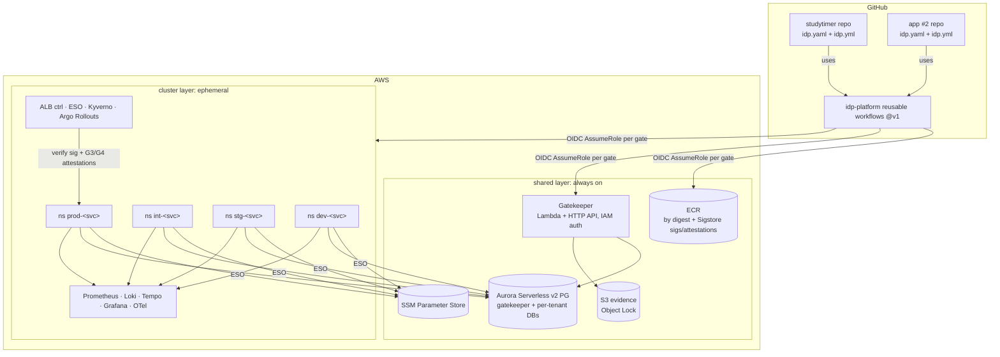

# Architecture overview

This document gives the high-level view. The platform (`idp-platform`) serves any number of tenant repos (StudyTimer is the first); see [../platform/service-contract.md](../platform/service-contract.md) for the interface between them. Decisions are in [../adr/](../adr/) and delivery sequencing is in [../plan/PROJECT_PLAN.md](../plan/PROJECT_PLAN.md).

## 1. From ticket to production

```mermaid
flowchart LR
  J[Jira ticket<br/>hardened template] -->|Atlassian MCP| CC[Claude Code in any tenant repo<br/>idp-agentic plugin: /implement-ticket]
  CC --> S[spec / plan / tasks]
  S -->|spec:guided| HA{{Human: make approve-spec}}
  S -->|spec:auto| T
  HA --> T[failing tests<br/>AC-tagged]
  T --> I[implement]
  I --> V[make verify]
  V --> R[reviewer subagents]
  R --> PR[Draft PR]
  PR --> CI[PR checks<br/>GitHub Actions]
  CI --> HB{{Human: approve + merge}}
  %% PR checks and G0-G5 run from idp-platform reusable workflows, parameterised by the tenant's idp.yaml
  HB --> G0[G0 build/sign]
  G0 --> G1[G1 dev smoke]
  G1 --> G2[G2 int cert]
  G2 --> G3[G3 stg cert]
  G3 --> G4{{G4 human decision<br/>GitHub Environment}}
  G4 --> G5[G5 canary in prod<br/>auto-abort]
  G0 & G1 & G2 & G3 -.HOLD.-> H[Jira Gate Hold<br/>→ owner fixes → new digest]
```

## 2. Platform components

## 3. Trust boundaries (summary; full threat model in iteration 3)
- **GitHub → AWS:** OIDC only, with each role's trust policy scoped to `repo:<owner>/<tenant-repo>:environment:<env>`. One role per tenant per gate, least privilege.
- **Artifact trust:** keyless cosign signatures and attestations made by the **platform's reusable workflows** on behalf of any tenant repo. Kyverno pins the signer to `idp-platform/.github/workflows/_g0-build.yml@refs/tags/v*` and checks the source repo against the catalog.
- **Tenant isolation:** OIDC roles, ECR repos, DB users, SSM paths and namespaces are per service (`modules/service-onboarding`); a tenant's workflow can only assume its own roles.
- **Evidence trust:** the Gatekeeper accepts evidence only from gate roles (SigV4); it verifies bundle hashes against the S3 WORM copy.
- **Agent trust:** the agent runs under your identity, inside permissions + hooks + rulesets. It has no AWS mutating rights and no merge or approve rights.
